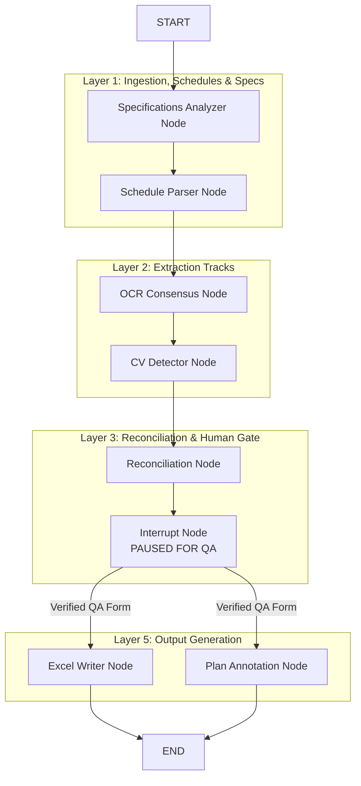
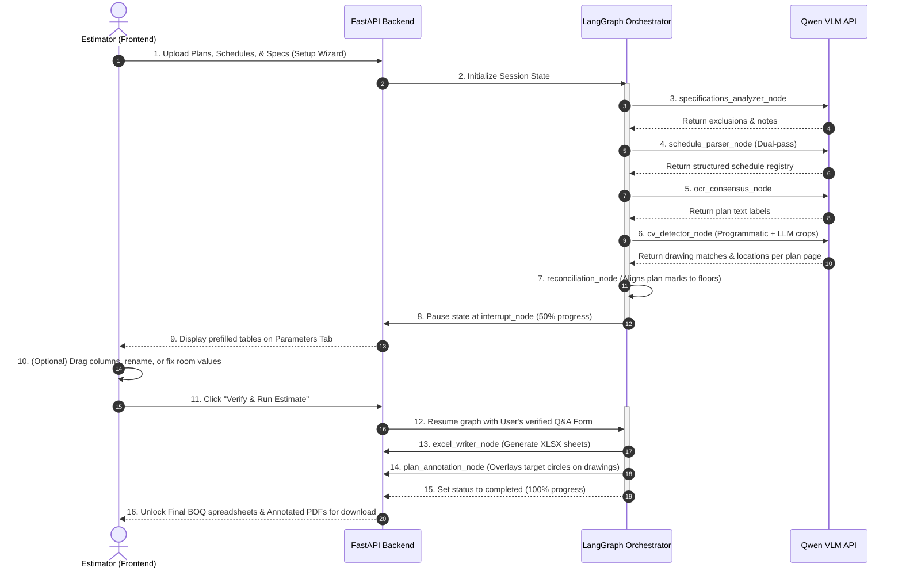

# Costmate V3 Agentic Architecture

Costmate is built on a structured, layered multi-agent swarm orchestrated by **LangGraph**. The system processes architectural blueprints, specifications, and schedules to produce a complete Bill of Quantities (BOQ).

---

## 🏗️ Layer-Wise Architecture

---

## 🤖 Layer & Agent Responsibilities

| Layer | Agent / Node | Input | Target / Output | Role & Responsibility | Why We Use It |
| :--- | :--- | :--- | :--- | :--- | :--- |
| **Layer 1** | **Specifications Analyzer** | Raw `.docx`/`.txt` specification files | `specifications_insights` (JSON) | Extracts hardware exclusions (e.g. Aluminium exclusions), materials, and project constraints. | Filters out materials not in the estimator's scope to prevent wrong pricing. |
| **Layer 1** | **Schedule Parser** | Uploaded Schedule sheets (Image/PDF) | `schedule_data` (JSON) | Extracts door/window schedule tables (sizes, counts, frames) using dual-pass Qwen-72B VLM. | Digitizes structural schedule parameters into a canonical format. |
| **Layer 2** | **OCR Consensus** | Uploaded Plan drawings (PDF/Image) | `ocr_results` (Text list) | Multi-pass text parser to extract text labels and room locations from plans. | Ensures room tags and numbers are extracted with high character accuracy. |
| **Layer 2** | **CV Detector** | Uploaded Plan drawings (PDF/Image) + `schedule_data` | `cv_results` (JSON list of matches) | Matches marks (e.g. D1, W2) to layouts, cropping images and classifying swing directions. | Physically locates door/window icons on drawings and detects opening swing modes. |
| **Layer 3** | **Reconciliation Node** | Outputs from Layers 1 & 2 | `qa_prefilled` (JSON) + `unresolved_queue` | Merges OCR text extraction and CV detection results; flags mismatching doors for human check. | Combines visual/textual data and structures the review dashboard. |
| **Layer 3** | **Interrupt Node** | Prefilled QA schema | User input updates via UI | Halts the LangGraph run state machine until the user validates the parameters. | Acts as the **Human Gate** to ensure 100% precision before final calculations. |
| **Layer 5** | **Excel Writer** | Verified Q&A Form | Formatted `.xlsx` BOQ | Generates Estimation and Raw schedules, applying correct column orders. | Builds the final customer-ready Microsoft Excel takeoff sheet. |
| **Layer 5** | **Plan Annotation** | Verified Q&A Form + Plans | Annotated plan drawings | Overlays green/red pins on plans pointing to located door/window openings. | Provides visual validation of all detected items directly on the layout drawings. |

---

## 🔄 Flow of Execution

